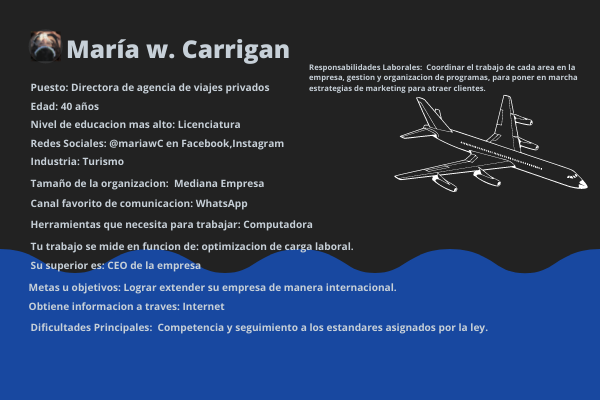

# Practica 1

[Requirimientos ⚡](./Requerimientos.doc)

[Buyer Persona v.1 👨🏻‍💻](./BuyerPerson.doc)

[Publico Objetivo 🙋🏻‍♂️](https://miro.com/app/board/uXjVOIyjThA=/?invite_link_id=311858802596)

[Wireframe and UX/UI 📱](https://www.figma.com/file/nMI217B6qfWNj7iTBXTG9d/Abogabot?node-id=0%3A1)

[Diagrama de Flujo ☣️](https://lucid.app/lucidchart/09dcf6de-1bb5-4073-be7d-0149bd5aaeb1/edit?invitationId=inv_c62da25d-19cf-4c70-abea-d639b7d1814c)

[Diagrama de Planeacion 📅](https://imgur.com/a/oNrytba)

